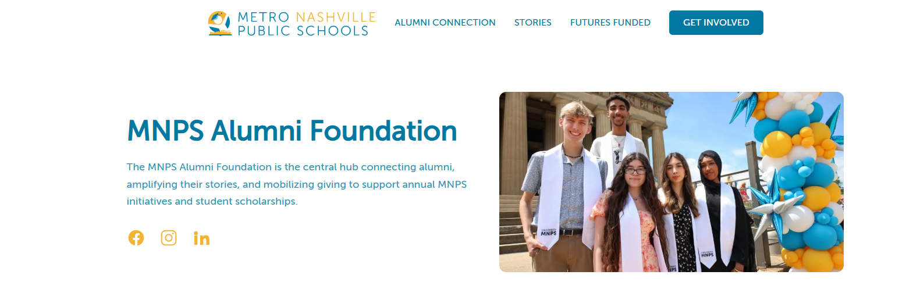

<h1 align="center">
  <br>
    <a href="https://mnpsalumni.org"></a>
  <br>
  <a href="https://mnpsalumni.org">MNPS Alumni Foundation</a>
  <br>
</h1>

## Description

A website for the MNPS Alumni Foundation to connect alumni, foster connections,
and raise donations.

## Recommended VSCode Extensions

- ESLint
- Prettier
- Astro
- markdownlint
- Tailwind CSS IntelliSense

## Local Development

Install the dependencies:

```sh
pnpm install
```

Start the development server:

```sh
pnpm dev
```

Run the linter

```sh
pnpm lint
```

Build the production site:

```sh
pnpm build
```

Preview the production site:

```sh
pnpm preview
```

## Banner Image

The banner image was taken from Instagram and can be found [at this link](https://www.instagram.com/p/DJFarxkPg1I/).
